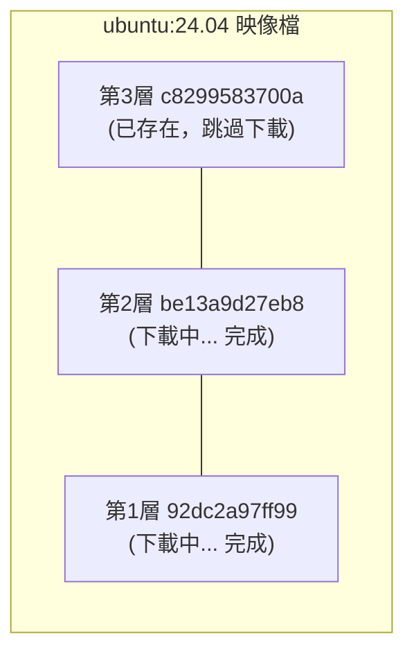

## 4.1 獲取映像檔

從 Docker 映像檔倉庫獲取映像檔可謂是 Docker 運作的第一步。本節將介紹如何使用 `docker pull` 命令下載映像檔，以及如何理解下載過程。

> **版本號最佳實踐**
>
> - **永遠指定版本號**：避免使用 `latest` 標籤，應指定具體的版本（如 `ubuntu:24.04`、`nginx:1.28`），以確保映像檔內容穩定一致。
> - **在生產環境使用摘要**：優先使用映像檔摘要（SHA256）而非標籤，如 `nginx@sha256:abc123...`，因為摘要不可變。
> - **定期評估依賴**：即使指定了版本號，仍應定期檢查依賴的基礎映像檔是否有安全更新。

### 4.1.1 docker pull 命令

從映像檔倉庫獲取映像檔的命令是 `docker pull`：

```bash
docker pull [選項] [Registry地址/]倉庫名[:標籤]
```

#### 映像檔名稱格式

Docker 映像檔名稱由 Registry 地址、使用者名稱、倉庫名和標籤組成。其標準格式如下：

```bash
docker.io / library / ubuntu : 24.04
────┬────   ───┬───   ──┬───   ──┬──
    │         │        │        │
Registry地址  使用者名稱    倉庫名    標籤
 (可省略)    (可省略)
```
| 組成部分 | 說明 | 預設值 |
|---------|------|--------|
| Registry 地址 | 映像檔倉庫地址 | `docker.io` (Docker Hub)|
| 使用者名稱 | 映像檔所屬使用者/組織 | `library` (官方映像檔)|
| 倉庫名 | 映像檔名稱 | 必須指定 |
| 標籤 | 版本標識 | `latest` |

#### 示例

```bash
## 完整格式

$ docker pull docker.io/library/ubuntu:24.04

## 省略 Registry（預設 Docker Hub）

$ docker pull library/ubuntu:24.04

## 省略 library（官方映像檔）

$ docker pull ubuntu:24.04

## 省略標籤（預設 latest）

$ docker pull ubuntu

## 拉取第三方映像檔

$ docker pull bitnami/redis:latest

## 從其他 Registry 拉取

$ docker pull ghcr.io/username/myapp:v1.0
```
---

### 4.1.2 下載過程解析

當我們執行 `docker pull` 命令時，Docker 會輸出詳細的下載進度。讓我們以 `ubuntu:24.04` 為例來解析這些資訊。

```bash
$ docker pull ubuntu:24.04
24.04: Pulling from library/ubuntu
92dc2a97ff99: Pull complete
be13a9d27eb8: Pull complete
c8299583700a: Pull complete
Digest: sha256:4bc3ae6596938cb0d9e5ac51a1152ec9dcac2a1c50829c74abd9c4361e321b26
Status: Downloaded newer image for ubuntu:24.04
docker.io/library/ubuntu:24.04
```

#### 輸出解讀

| 輸出內容 | 說明 |
|---------|------|
| `Pulling from library/ubuntu` | 正在從官方 ubuntu 倉庫拉取 |
| `92dc2a97ff99: Pull complete` | 各層的下載狀態 (顯示層 ID 前 12 位)|
| `Digest: sha256:...` | 映像檔內容的唯一摘要 |
| `docker.io/library/ubuntu:24.04` | 映像檔的完整名稱 |

#### 分層下載

從輸出可以看到，映像檔是 **分層下載** 的：


如果本地已有相同的層，Docker 會跳過下載，節省頻寬和時間。

---

### 4.1.3 常用選項

`docker pull` 命令支援多種選項來滿足不同的下載需求，例如下載所有標籤、指定平臺架構等。

| 選項 | 說明 | 示例 |
|------|------|------|
| `--all-tags, -a` | 拉取所有標籤 | `docker pull -a ubuntu` |
| `--platform` | 指定平臺架構 | `docker pull --platform linux/arm64 nginx` |
| `--quiet, -q` | 靜默模式 | `docker pull -q nginx` |

#### 指定平臺

在 Apple Silicon Mac 上拉取 x86 映像檔：

```bash
$ docker pull --platform linux/amd64 nginx
```
---

### 4.1.4 拉取後執行

拉取映像檔後，可以基於它啟動容器：

```bash
## 拉取映像檔

$ docker pull ubuntu:24.04

## 執行容器

$ docker run -it --rm ubuntu:24.04 bash
root@e7009c6ce357:/# cat /etc/os-release
PRETTY_NAME="Ubuntu 24.04 LTS"
...
root@e7009c6ce357:/# exit
```

> 本例使用 `ubuntu:24.04` 這樣的具體版本標籤是最佳實踐。若無特殊需求，避免使用 `docker pull ubuntu` 或 `ubuntu:latest`，因為映像檔內容可能在某個時刻發生變化。

**引數說明**：

| 引數 | 說明 |
|------|------|
| `-it` | 互動式終端模式 |
| `--rm` | 退出後自動刪除容器 |
| `bash` | 啟動命令 |

> 💡 `docker run` 在需要時會自動 `pull` 映像檔，因此通常不需要單獨執行 `docker pull`。

---

### 4.1.5 映像檔加速

從 Docker Hub 下載可能較慢。可以配置映像檔加速器：

```jsonc
// /etc/docker/daemon.json (Linux)
// ~/.docker/daemon.json (Docker Desktop)
{
  "registry-mirrors": [
    "https://your-accelerator-url"
  ]
}
```
配置後重啟 Docker：

```bash
$ sudo systemctl restart docker  # Linux

## 或在 Docker Desktop 中重啟
```
詳見[映像檔加速器](../03_install/3.9_mirror.md)章節。

---

### 4.1.6 驗證映像檔完整性

為了確保下載的映像檔沒有被篡改且內容一致，我們可以校驗映像檔的摘要 (Digest)。

#### 檢視映像檔摘要

```bash
$ docker images --digests ubuntu
REPOSITORY   TAG     DIGEST                                                                    IMAGE ID
ubuntu       24.04   sha256:4bc3ae6596938cb0d9e5ac51a1152ec9dcac2a1c50829c74abd9c4361e321b26   ca2b0f26964c
```

#### 使用摘要拉取

用摘要拉取可確保獲取完全相同的映像檔：

```bash
$ docker pull ubuntu@sha256:4bc3ae6596938cb0d9e5ac51a1152ec9dcac2a1c50829c74abd9c4361e321b26
```
> 筆者建議：生產環境使用摘要而非標籤，因為標籤可能被覆蓋，摘要則是不可變的。

---

### 4.1.7 常見問題

在使用 `docker pull` 過程中，可能會遇到下載速度慢、映像檔不存在或磁碟空間不足等問題。以下是一些常見問題的排查思路。

#### Q：下載速度很慢

1. 配置映像檔加速器
2. 檢查網路連線
3. 嘗試拉取更小的映像檔版本 (如 `alpine` 變體)

#### Q：提示映像檔不存在

```bash
Error: pull access denied, repository does not exist
```
可能原因：

- 映像檔名拼寫錯誤
- 私有映像檔未登入 (需要 `docker login`)
- 映像檔確實不存在

#### Q：磁碟空間不足

```bash
## 清理未使用的映像檔

$ docker image prune

## 清理所有未使用資源

$ docker system prune
```
---
