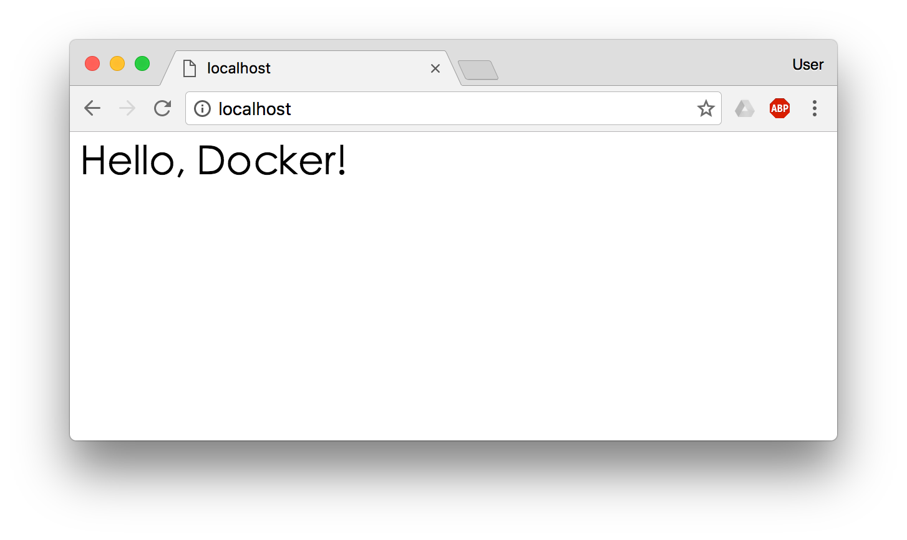

## 4.4 利用 commit 理解映像檔構成

> 注意：如果你是初學者，可以暫時跳過後面的內容，直接學習[容器](../05_container/)一節。

`docker commit` 除了幫助理解映像檔分層之外，在少數情境下也可用於留存現場，例如事後分析被入侵容器的狀態；但是，日常定製映像檔不應依賴 `docker commit`，而應使用下一節介紹的 `Dockerfile`。

映像檔是容器的基礎，每次執行 `docker run` 的時候都會指定哪個映像檔作為容器執行的基礎。在之前的例子中，我們所使用的都是來自於 Docker Hub 的映像檔。直接使用這些映像檔是可以滿足一定的需求，而當這些映像檔無法直接滿足需求時，我們就需要定製這些映像檔。接下來的幾節就將講解如何定製映像檔。

回顧一下之前我們學到的知識，映像檔是多層儲存，每一層是在前一層的基礎上進行的修改；而容器同樣也是多層儲存，它以映像檔層為只讀基礎，並在最上方增加一層供執行時寫入的容器層。

現在讓我們以定製一個 Web 伺服器為例子，來講解映像檔是如何構建的。

> **版本提示**：以下示例中 `nginx` 映像檔使用預設 `latest` 標籤。生產環境建議指定具體版本號（如 `nginx:1.28`），以避免映像檔更新帶來的不相容性。

```bash
$ docker run --name webserver -d -p 8080:80 nginx
```
這條命令會用 `nginx` 映像檔啟動一個容器，命名為 `webserver`。其中，`-p 8080:80` 表示把宿主機的 `8080` 埠對映到容器內的 `80` 埠，這樣我們就可以用瀏覽器去訪問這個 `nginx` 伺服器。

如果是在本機執行的 Docker，那麼可以直接訪問：`http://localhost:8080`；如果是在虛擬機器、雲伺服器上安裝的 Docker，則需要將 `localhost` 換為虛擬機器地址或者實際雲伺服器地址，並保留 `8080` 埠。

直接用瀏覽器訪問的話，我們會看到預設的 Nginx 歡迎頁面。


現在，假設我們非常不喜歡這個歡迎頁面，我們希望改成歡迎 Docker 的文字，我們可以使用 `docker exec` 命令進入容器，修改其內容。

```bash
$ docker exec -it webserver bash
root@3729b97e8226:/# echo '<h1>Hello, Docker!</h1>' > /usr/share/nginx/html/index.html
root@3729b97e8226:/# exit
exit
```
我們以互動式終端方式進入 `webserver` 容器，並執行了 `bash` 命令，也就是獲得一個可操作的 Shell。

然後，我們用 `<h1>Hello, Docker!</h1>` 覆蓋了 `/usr/share/nginx/html/index.html` 的內容。

現在我們再重新整理瀏覽器的話，會發現內容被改變了。



我們修改了容器的檔案，也就是改動了容器的儲存層。我們可以透過 `docker diff` 命令看到具體的改動。

```bash
$ docker diff webserver
C /root
A /root/.bash_history
C /run
C /usr
C /usr/share
C /usr/share/nginx
C /usr/share/nginx/html
C /usr/share/nginx/html/index.html
C /var
C /var/cache
C /var/cache/nginx
A /var/cache/nginx/client_temp
A /var/cache/nginx/fastcgi_temp
A /var/cache/nginx/proxy_temp
A /var/cache/nginx/scgi_temp
A /var/cache/nginx/uwsgi_temp
```
其中，`A` 表示新增（Added），`C` 表示變更（Changed），`D` 表示刪除（Deleted）。

現在我們定製好了變化，我們希望能將其儲存下來形成映像檔。

要知道，當我們執行一個容器的時候 (如果不使用卷的話)，我們做的任何檔案修改都會被記錄於容器儲存層裡。而 Docker 提供了一個 `docker commit` 命令，可以將容器的儲存層儲存下來成為映像檔。換句話說，就是在原有映像檔的基礎上，再疊加上容器的儲存層，並構成新的映像檔。以後我們執行這個新映像檔的時候，就會擁有原有容器最後的檔案變化。

`docker commit` 的語法格式為：

```bash
docker commit [選項] <容器ID或容器名> [<倉庫名>[:<標籤>]]
```
我們可以用下面的命令將容器儲存為映像檔。預設情況下，`docker commit` 會在提交時暫停容器程序，以降低資料損壞的風險；如果確實不希望暫停，可以顯式指定 `--no-pause`：

```bash
$ docker commit \
    --author "Tao Wang <twang2218@gmail.com>" \
    --message "修改了預設網頁" \
    webserver \
    nginx:v2
sha256:07e33465974800ce65751acc279adc6ed2dc5ed4e0838f8b86f0c87aa1795214
```
其中 `--author` 是指定修改的作者，而 `--message` 則是記錄本次修改的內容。這點和 `git` 版本控制相似，不過這裡這些資訊可以省略留空。

我們可以在 `docker image ls` 中看到這個新定製的映像檔。下面的輸出僅為示例，標籤、建立時間和大小會隨著映像檔版本和本地環境不同而變化：

```bash
$ docker image ls nginx
REPOSITORY          TAG                 IMAGE ID            CREATED             SIZE
nginx               v2                  07e334659748        9 seconds ago       181.5 MB
nginx               1.30                05a60462f8ba        12 days ago         181.5 MB
nginx               latest              e43d811ce2f4        4 weeks ago         181.5 MB
```

> **版本說明**：上面示例中 `nginx:1.30` 代表 1.30 系列的最新 patch 版本。在實際應用中應根據需求選擇確切的版本號，而不是盲目使用 `latest`。

我們還可以用 `docker history` 具體檢視映像檔內的歷史記錄。例如先執行 `docker history nginx:v2`，再對比 `docker history nginx:latest`，就能看到我們剛剛提交出來的新層。

```bash
$ docker history nginx:v2
IMAGE               CREATED             CREATED BY                                      SIZE                COMMENT
07e334659748        54 seconds ago      nginx -g daemon off;                            95 B                修改了預設網頁
e43d811ce2f4        4 weeks ago         /bin/sh -c #(nop)  CMD ["nginx" "-g" "daemon    0 B
<missing>           4 weeks ago         /bin/sh -c #(nop)  EXPOSE 443/tcp 80/tcp        0 B
<missing>           4 weeks ago         /bin/sh -c ln -sf /dev/stdout /var/log/nginx/   22 B
<missing>           4 weeks ago         /bin/sh -c apt-key adv --keyserver hkp://pgp.   58.46 MB
<missing>           4 weeks ago         /bin/sh -c #(nop)  ENV NGINX_VERSION=1.27.0-1   0 B
<missing>           4 weeks ago         /bin/sh -c #(nop)  MAINTAINER NGINX Docker Ma   0 B
<missing>           4 weeks ago         /bin/sh -c #(nop)  CMD ["/bin/bash"]            0 B
<missing>           4 weeks ago         /bin/sh -c #(nop) ADD file:23aa4f893e3288698c   123 MB
```
新的映像檔定製好後，我們可以來執行這個映像檔。

```bash
$ docker run --name web2 -d -p 81:80 nginx:v2
```
這裡我們將新容器命名為 `web2`，並把宿主機的 `81` 埠對映到容器的 `80` 埠。訪問 `http://localhost:81` 後，看到的內容應該和之前修改後的 `webserver` 一樣。

至此，我們第一次完成了定製映像檔，使用的是 `docker commit` 命令，手動操作給舊的映像檔新增了新的一層，形成新的映像檔，對映像檔多層儲存應該有了更直觀的感覺。

### 4.4.1 慎用 `docker commit`

使用 `docker commit` 命令雖然可以比較直觀地幫助理解映像檔分層儲存的概念，但它不應作為常規定製映像檔的方式。

首先，如果仔細觀察之前的 `docker diff webserver` 的結果，你會發現除了真正想要修改的 `/usr/share/nginx/html/index.html` 檔案外，由於命令的執行，還有很多檔案被改動或新增了。這還僅僅是最簡單的操作，如果是安裝軟體包、編譯構建，那會有大量的無關內容被新增進來，將會導致映像檔極為臃腫。

此外，使用 `docker commit` 意味著所有對映像檔的操作都是黑箱操作，生成的映像檔也被稱為 **黑箱映像檔**，換句話說，就是除了製作映像檔的人知道執行過什麼命令、怎麼生成的映像檔，別人根本無從得知。而且，即使是這個製作映像檔的人，過一段時間後也無法記清具體的操作。這種黑箱映像檔的維護工作是非常痛苦的。

而且，回顧之前提及的映像檔所使用的分層儲存的概念，除當前層外，之前的每一層都不會發生改變。換句話說，任何修改的結果僅僅是在當前層進行標記、新增、修改，而不會改動上一層。如果使用 `docker commit` 製作映像檔，以及後期繼續修改，那麼每一次修改都會讓映像檔再膨脹一層；即使某些檔案在更高層裡被刪除了，它們仍然存在於更低層中，只是在最終檢視裡被隱藏而已。因此，日常定製映像檔應使用下一節介紹的 `Dockerfile`，把構建過程寫成可重複執行、便於審查的文字。
