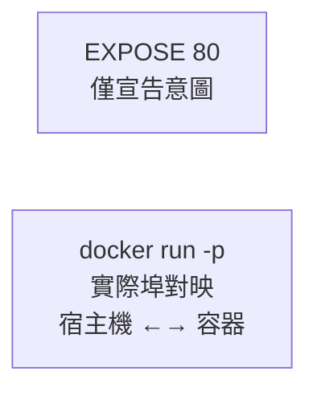

## 7.9 EXPOSE 暴露埠

### 7.9.1 基本語法

```docker
EXPOSE <埠> [<埠>/<協議>...]
```
`EXPOSE` 宣告容器執行時提供服務的埠。這是一個 **文件性質的宣告**，告訴使用者容器會監聽哪些埠。

---

### 7.9.2 基本用法

```docker
## 宣告單個埠

EXPOSE 80

## 宣告多個埠

EXPOSE 80 443

## 宣告 TCP 和 UDP 埠

EXPOSE 80/tcp
EXPOSE 53/udp
```
---

### 7.9.3 EXPOSE 的作用

#### 1. 文件說明

告訴映像檔使用者，容器將在哪些埠提供服務：

```docker
## 使用者一看就知道這是 web 應用

EXPOSE 80 443
```
```bash
## 檢視映像檔暴露的埠

$ docker inspect nginx --format '{{.Config.ExposedPorts}}'
map[80/tcp:{}]
```

#### 2. 配合 -P 使用

使用 `docker run -P` 時，Docker 會自動對映 EXPOSE 的埠到宿主機隨機埠：

```docker
## Dockerfile

EXPOSE 80
```
```bash
$ docker run -P nginx
$ docker port $(docker ps -q)
80/tcp -> 0.0.0.0:32768
```
---

### 7.9.4 EXPOSE vs -p

| 特性 | EXPOSE | -p |
|------|--------|-----|
| **位置** | Dockerfile | docker run 命令 |
| **作用** | 宣告/文件 | 實際埠對映 |
| **是否必需** | 否 | 是 (外部訪問時)|
| **對映發生時** | 不發生 | 執行時發生 |



#### 沒有 EXPOSE 也能 -p

```docker
## 即使沒有 EXPOSE，也可以使用 -p

FROM nginx

## 沒有 EXPOSE

...
```
```bash
## 仍然可以對映埠

$ docker run -p 8080:80 mynginx
```
---

### 7.9.5 常見誤解

#### 誤解：EXPOSE 會開啟埠

```docker
## ❌ 錯誤理解：這不會讓容器可從外部訪問

EXPOSE 80
```
EXPOSE 不會：

- 自動進行埠對映
- 讓服務可從外部訪問
- 在容器啟動時開啟埠監聽

EXPOSE 只是後設資料宣告。容器是否實際監聽該埠，取決於容器內的應用。

#### 正確理解

```docker
## Dockerfile

FROM nginx
EXPOSE 80    # 1. 宣告：這個容器會在 80 埠提供服務
```
```bash
## 執行：需要 -p 才能從外部訪問

$ docker run -p 8080:80 nginx    # 2. 對映：宿主機 8080 → 容器 80
```
---

### 7.9.6 最佳實踐

#### 1. 總是宣告應用使用的埠

```docker
## Web 服務

FROM nginx
EXPOSE 80 443

## 資料庫

FROM postgres
EXPOSE 5432

## Redis

FROM redis
EXPOSE 6379
```

#### 2. 使用明確的協議

```docker
## 預設是 TCP

EXPOSE 80

## 明確指定 UDP

EXPOSE 53/udp

## 同時支援 TCP 和 UDP

EXPOSE 53/tcp 53/udp
```

#### 3. 與應用實際埠保持一致

```docker
## ✅ 好：EXPOSE 與應用埠一致

ENV PORT=3000
EXPOSE 3000
CMD ["node", "server.js"]

## ❌ 差：EXPOSE 與應用埠不一致（誤導）

EXPOSE 80
CMD ["node", "server.js"]  # 實際監聽 3000
```
---

### 7.9.7 使用環境變數

```docker
ARG PORT=80
EXPOSE $PORT
```
---

### 7.9.8 在 Compose 中

在 Compose 中配置如下：

```yaml
services:
  web:
    build: .
    ports:
      - "8080:80"    # 對映埠（類似 -p）
    expose:
      - "80"         # 僅宣告（類似 EXPOSE）
```
`expose` 在 Compose 中僅用於容器間通訊的文件說明，不進行埠對映。

---
