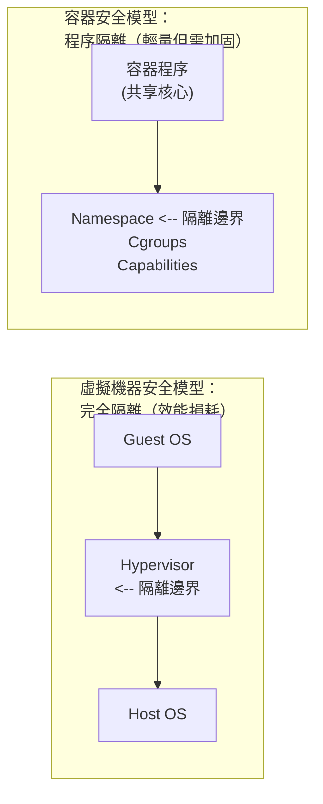

# 第十八章 安全

容器安全是生產環境部署的核心考量。本章介紹 Docker 的安全機制和最佳實踐。

## 容器安全的本質

> **核心問題**：容器共享宿主機核心，隔離性弱於虛擬機器。如何在便利性和安全性之間取得平衡？

## 本章內容

本章涵蓋 Docker 安全的多個層面，從核心隔離機制到執行時防護和供應鏈安全。

* [核心名稱空間](18.1_kernel_ns.md)
  * 名稱空間的安全意義、User Namespace 與提權防護。

* [控制組](18.2_control_group.md)
  * 透過 Cgroups 限制容器資源使用，防止資源耗盡攻擊。

* [服務端防護](18.3_daemon_sec.md)
  * Docker 守護程序的安全配置與網路訪問控制。

* [核心能力機制](18.4_kernel_capability.md)
  * Linux Capabilities 的細粒度許可權控制。

* [其它安全特性](18.5_other_feature.md)
  * 映像檔安全（漏洞掃描、簽名驗證）、執行時安全（非 root 執行、只讀檔案系統、Seccomp、AppArmor）、Dockerfile 安全實踐、軟體供應鏈安全（SBOM、SLSA）。

* [映像檔安全](18.6_image_security.md)
  * 容器映像檔的安全掃描、漏洞檢測與簽名驗證。

## 安全掃描清單

部署前檢查：

| 檢查項 | 命令/方法 |
|--------|----------|
| 漏洞掃描 | `docker scout cves` 或 `trivy` |
| 非 root 執行 | 檢查 Dockerfile 中的 `USER` |
| 資源限制 | 檢查 `-m`, `--cpus` 引數 |
| 只讀檔案系統 | 檢查 `--read-only` |
| 無特權模式 | 確認沒有 `--privileged` |
| 最小能力 | 檢查 `--cap-drop=all` |
| 網路隔離 | 檢查網路配置 |
| 敏感資訊 | 確認無硬編碼密碼 |
