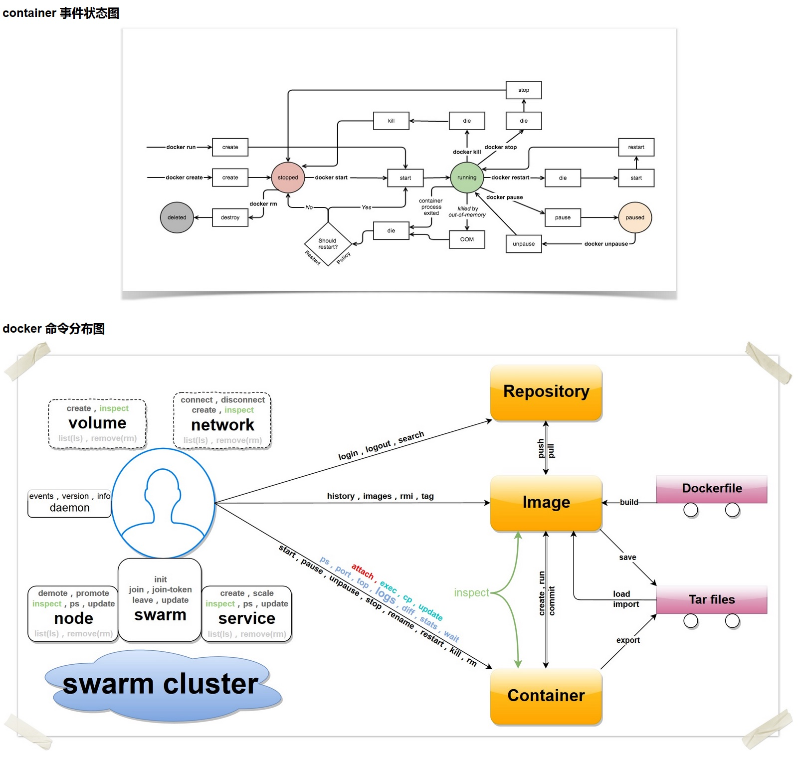

## 用戶端命令 - docker

### 用戶端命令選項

* `--config=""`：指定用戶端配置檔案，預設為 `~/.docker`；
* `-D=true|false`：是否使用 debug 模式。預設不開啟；
* `-H, --host=[]`：指定命令對應 Docker 守護程序的監聽介面，可以為 unix 套接字 `unix:///path/to/socket`，檔案控制代碼 `fd://socketfd` 或 tcp 套接字 `tcp://[host[:port]]`，預設為 `unix:///var/run/docker.sock`；
* `-l, --log-level="debug|info|warn|error|fatal"`：指定日誌輸出級別；
* `--tls=true|false`：是否對 Docker 守護程序啟用 TLS 安全機制，預設為否；
* `--tlscacert=/.docker/ca.pem`：TLS CA 簽名的可信證書檔案路徑；
* `--tlscert=/.docker/cert.pem`：TLS 可信證書檔案路徑；
* `--tlskey=/.docker/key.pem`：TLS 金鑰檔案路徑；
* `--tlsverify=true|false`：啟用 TLS 校驗，預設為否。

### 用戶端命令

可以透過 `docker COMMAND --help` 來檢視這些命令的具體用法。

* `attach`：依附到一個正在執行的容器中；
* `build`：從一個 Dockerfile 建立一個映像檔；
* `commit`：從一個容器的修改中建立一個新的映像檔；
* `cp`：在容器和本地宿主系統之間複製檔案中；
* `create`：建立一個新容器，但並不執行它；
* `diff`：檢查一個容器內檔案系統的修改，包括修改和增加；
* `events`：從伺服器端獲取實時的事件；
* `exec`：在執行的容器內執行命令；
* `export`：匯出容器內容為一個 `tar` 包；
* `history`：顯示一個映像檔的歷史資訊；
* `images`：列出存在的映像檔；
* `import`：匯入一個檔案 (典型為 `tar` 包) 路徑或目錄來建立一個本地映像檔；
* `info`：顯示一些相關的系統資訊；
* `inspect`：顯示一個容器的具體配置資訊；
* `kill`：關閉一個執行中的容器 (包括程序和所有相關資源)；
* `load`：從一個 tar 包中載入一個映像檔；
* `login`：註冊或登入到一個 Docker 的倉庫伺服器；
* `logout`：從 Docker 的倉庫伺服器登出；
* `logs`：獲取容器的 log 資訊；
* `network`：管理 Docker 的網路，包括檢視、建立、刪除、掛載、解除安裝等；
* `node`：管理 swarm 叢集中的節點，包括檢視、更新、刪除、提升/取消管理節點等；
* `pause`：暫停一個容器中的所有程序；
* `port`：查詢一個 nat 到一個私有網口的公共口；
* `ps`：列出主機上的容器；
* `pull`：從一個 Docker 的倉庫伺服器下拉一個映像檔或倉庫；
* `push`：將一個映像檔或者倉庫推送到一個 Docker 的註冊伺服器；
* `rename`：重新命名一個容器；
* `restart`：重啟一個執行中的容器；
* `rm`：刪除給定的若干個容器；
* `rmi`：刪除給定的若干個映像檔；
* `run`：建立一個新容器，並在其中執行給定命令；
* `save`：儲存一個映像檔為 tar 包檔案；
* `search`：在 Docker index 中搜尋一個映像檔；
* `service`：管理 Docker 所啟動的應用服務，包括建立、更新、刪除等；
* `start`：啟動一個容器；
* `stats`：輸出 (一個或多個) 容器的資源使用統計資訊；
* `stop`：終止一個執行中的容器；
* `swarm`：管理 Docker swarm 叢集，包括建立、加入、退出、更新等；
* `tag`：為一個映像檔打標籤；
* `top`：檢視一個容器中的正在執行的程序資訊；
* `unpause`：將一個容器內所有的程序從暫停狀態中恢復；
* `update`：更新指定的若干容器的配置資訊；
* `version`：輸出 Docker 的版本資訊；
* `volume`：管理 Docker volume，包括檢視、建立、刪除等；
* `wait`：阻塞直到一個容器終止，然後輸出它的退出符。

### 一張圖總結 Docker 的命令

如圖 16-1 所示，Docker 常用用戶端命令可按功能分組理解。

圖 A-1：Docker 用戶端命令分類示意圖

### 參考

* [官方文件](https://docs.docker.com/reference/cli/docker/)
